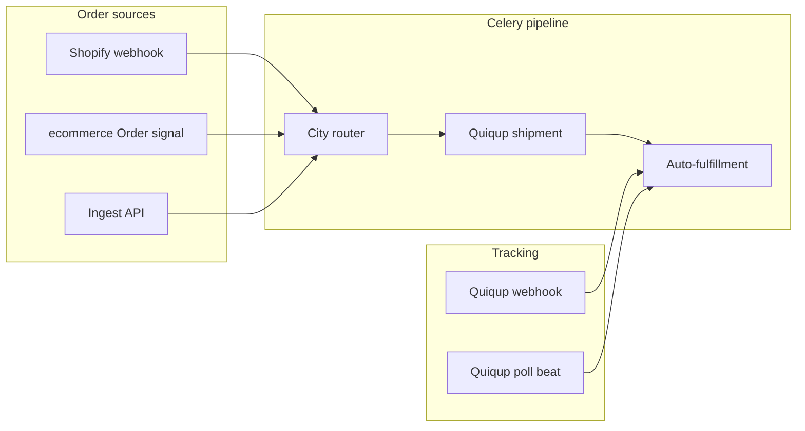

# Logistics app — integrations

Centralized shipping and fulfillment for **Shopify**, the native **ecommerce** checkout, and external systems via a **custom ingest API**. Courier routing uses admin-defined city rules; shipments are created through **Quiqup**; tracking and fulfillments sync back to each platform.

## Architecture



| Step | Task | Description |
|------|------|-------------|
| 1 | Ingest | Normalize order → `Shipment` |
| 2 | `process_shipment_pipeline` | Route city → create Quiqup order → fulfill |
| 3 | Tracking | Quiqup webhook or scheduled poll → status + tracking sync |

## Shopify-style fulfillment (storefront API)

Orders expose **only** `fulfillments` (not internal shipments):

| Endpoint | Purpose |
|----------|---------|
| `GET /api/v1/orders/{id}/` | Order + nested `fulfillments` + line `fulfillment_status` |
| `GET /api/v1/orders/{id}/fulfillment-inventory/` | Remaining quantities per line (staff) |
| `POST /api/v1/orders/{id}/fulfillments/` | Create fulfillment (`scope`: complete / partial) |

`logistics.Shipment` runs in the background and syncs tracking into `ecommerce.Fulfillment` rows.

## Integrations at a glance (internal)

| Integration | Trigger | Config |
|-------------|---------|--------|
| **Shopify** | `orders/create` webhook | Django admin → Shopify stores |
| **Ecommerce** | New `Order` → Celery | City rules + couriers |
| **Quiqup** | Pipeline + webhooks | `QUIQUP_*` in `.env` |

Logistics HTTP routes (webhooks only in production): `/api/v1/logistics/webhooks/...`  
Dev-only (`DEBUG`): mock Quiqup + `orders/ingest/`.

## HTTP endpoints

| Method | Path | Purpose |
|--------|------|---------|
| `POST` | `/webhooks/shopify/orders-create/` | Shopify order creation webhook |
| `POST` | `/webhooks/quiqup/` | Quiqup tracking / status updates |
| `POST` | `/orders/ingest/` | External order ingest (Bearer token) |

## Shopify

1. **Django admin → Logistics → Shopify stores** — add `shop_domain`, `access_token`, `webhook_secret`, set `is_active`.
2. In Shopify Admin → Settings → Notifications → Webhooks:
   - **Event:** Order creation
   - **URL:** `https://YOUR_DOMAIN/api/v1/logistics/webhooks/shopify/orders-create/`
   - **Format:** JSON
3. The view matches `X-Shopify-Shop-Domain` to an active store and verifies `X-Shopify-Hmac-Sha256` with that store’s `webhook_secret`.
4. Payload is logged, then `process_shopify_order_webhook` enqueues the shipment pipeline.

Inactive or unknown stores receive **403**.

See [Shopify webhooks](../docs/logistics/shopify-webhooks.md).

## Native ecommerce orders

When a new `ecommerce.Order` is created, `logistics.signals` enqueues `process_custom_order` (skipped if a shipment already exists for that order). COD is inferred when `financial_status` is `pending`.

Fulfillments are created when **Fulfillment configuration → auto_fulfill_enabled** is on.

## Custom ingest API

Set **Fulfillment configuration → ingest_api_token** in admin, then:

```http
POST /api/v1/logistics/orders/ingest/
Authorization: Bearer <ingest_api_token>
Content-Type: application/json
```

Example body:

```json
{
  "source_platform": "ecommerce",
  "external_order_id": "ext-12345",
  "order_number": "#1001",
  "ecommerce_order_id": 42,
  "city": "Lahore",
  "customer": {
    "name": "Jane Doe",
    "email": "jane@example.com",
    "phone": "+923001234567"
  },
  "shipping_address": {
    "address1": "123 Main St",
    "city": "Lahore",
    "country": "PK"
  },
  "line_items": [
    { "title": "T-Shirt", "sku": "TS-01", "quantity": 2 }
  ],
  "cod_amount": "1500.00"
}
```

Response **202**: `{ "shipment_id": <id>, "correlation_id": "<uuid>" }`.

`external_order_id` is required. Missing or wrong token → **401**; token not configured → **503**.

## Quiqup

Credentials live in **environment** (not admin):

```env
REDIS_URL=redis://localhost:6379/0
QUIQUP_USE_MOCK=1
LOGISTICS_QUIQUP_POLL_MINUTES=15
```

For production, set `QUIQUP_USE_MOCK=0` and use real credentials:

```env
QUIQUP_BASE_URL=https://platform-api.quiqup.com
QUIQUP_CLIENT_ID=
QUIQUP_CLIENT_SECRET=
```

Optional HTTP mock (same responses, hits Django):  
`QUIQUP_BASE_URL=http://127.0.0.1:8000/api/v1/logistics/mock/quiqup` with `QUIQUP_CLIENT_ID` / `QUIQUP_CLIENT_SECRET` any value (mock OAuth accepts all).

- Shipments: OAuth client credentials → `POST {QUIQUP_BASE_URL}/api/fulfilment/orders` with `service_kind` from city rules.
- **Webhook:** register Quiqup to `POST /api/v1/logistics/webhooks/quiqup/`; optional `quiqup_webhook_secret` in Fulfillment configuration (checked via `X-Quiqup-Token` or `Authorization: Bearer`).
- **Polling:** Celery beat runs `poll_quiqup_tracking_batch` every `LOGISTICS_QUIQUP_POLL_MINUTES` minutes.

See [Quiqup integration](../docs/logistics/quiqup-integration.md).

## Django admin

| Model | Role |
|-------|------|
| **Shopify stores** | Multi-store domains, tokens, webhook secrets |
| **City fulfillment rules** | City → courier + Quiqup `service_type` (lower `priority` wins; `*` = fallback) |
| **Courier configurations** | Active couriers; optional `supported_cities` JSON |
| **Fulfillment configuration** | Singleton: auto-fulfill, tracking sync, ingest token, Quiqup webhook secret, fallback courier |

See [Django admin setup](../docs/logistics/django-admin-setup.md).

## Celery workers

```bash
redis-server

celery -A settings worker -l info -Q logistics --concurrency=4
celery -A settings beat -l info --scheduler django_celery_beat.schedulers:DatabaseScheduler
```

| Task | Purpose |
|------|---------|
| `process_shipment_pipeline` | Route → Quiqup → fulfill |
| `process_shopify_order_webhook` | Parse webhook log → pipeline |
| `process_custom_order` | New ecommerce order → pipeline |
| `sync_tracking_updates` | Map status; update shipment + platforms |
| `poll_quiqup_tracking_batch` | Scheduled Quiqup polling |

Admin **Retry shipment** re-enqueues `process_shipment_pipeline`.

See [Celery workers](../docs/logistics/celery-workers.md).

## Local setup

```bash
# From ecommerce/ (manage.py directory)
DJANGO_USE_SQLITE=1 ./venv/bin/python manage.py seed_logistics
```

Sandbox env template: [`fixtures/env.sandbox.example`](fixtures/env.sandbox.example).  
Sample Shopify payload: [`fixtures/sample_shopify_order.json`](fixtures/sample_shopify_order.json).

See [Seed data](../docs/logistics/seed-data.md) and [Environment reference](../docs/logistics/env-reference.md).

## Further reading

| Doc | Topic |
|-----|--------|
| [Overview](../docs/logistics/overview.md) | End-to-end pipeline |
| [Shopify webhooks](../docs/logistics/shopify-webhooks.md) | Webhook registration |
| [Quiqup integration](../docs/logistics/quiqup-integration.md) | API & tracking |
| [Django admin setup](../docs/logistics/django-admin-setup.md) | Stores, rules, couriers |
| [Celery workers](../docs/logistics/celery-workers.md) | Workers & beat |
| [Environment reference](../docs/logistics/env-reference.md) | Env vars |
| [Seed data](../docs/logistics/seed-data.md) | Sandbox fixture |
